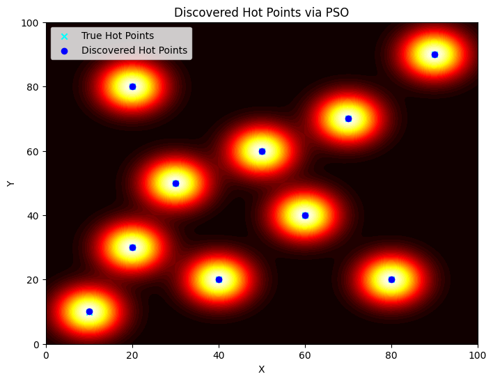
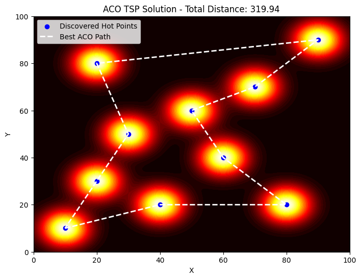
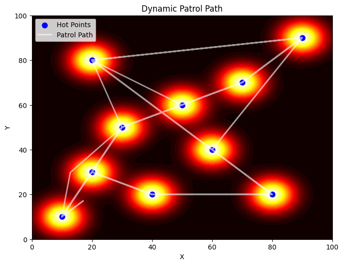
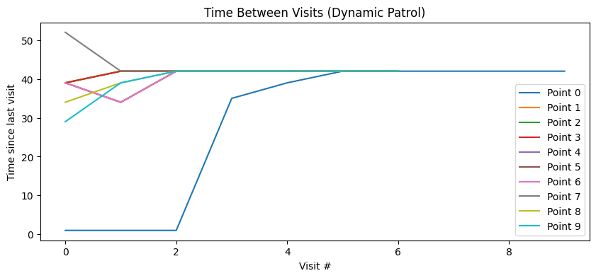
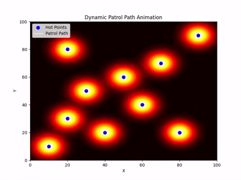

# 🔥 Dynamic Patrol Optimization in Unknown Continuous Space

This project simulates a dynamic patrolling system in an **unknown 2D continuous space** where the goal is to:

1. **Discover hot points** (areas of interest or activity)
2. **Find the shortest closed path** to compare with patrol path
3. **Dynamically patrol** these points to minimize the time they are left unvisited

---

## 📌 Project Structure

The experiment is divided into **three main phases**:

### 🧭 Phase 1: Hot Point Discovery (Exploration)

- Space is continuous and initially unknown.
- A **synthetic "heat map"** is simulated using Gaussian peaks.
- **Particle Swarm Optimization (PSO)** is used to discover the "hot" points (local maxima) in this space.



### 🧠 Phase 2: Fastest Path

- Once hot points are discovered, we compute the **shortest closed path** visiting all of them (TSP).
- This is solved using **Ant Colony Optimization (ACO)** to simulate cooperative path building.



### 🚨 Phase 3: Dynamic Patrolling

- A single agent patrols the discovered hot points.
- Instead of following a fixed loop, the agent uses a **dynamic scoring strategy** to prioritize:
  - Time since last visit
  - Distance to each hot point
  - (Optional) Importance of the point
- The goal is to **minimize the max time between visits** to any hot point.


---

## 📊 Extensions

This test is extensible to:
- 🔁 Multiple patrolling agents
- 🧠 Reinforcement Learning-based patrol logic
- ⚡ Energy-aware or probabilistic patrols
- 🎯 Adaptive importance weighting
## 📽️ Animation & Visualization

- Full visualizations of the heat map, discovered hot points, patrol path, and visit intervals.
- Animated patrol showing the **latest movement segment only** for clarity.



---

## 📦 Dependencies
```bash
pip install -r requirements.txt
